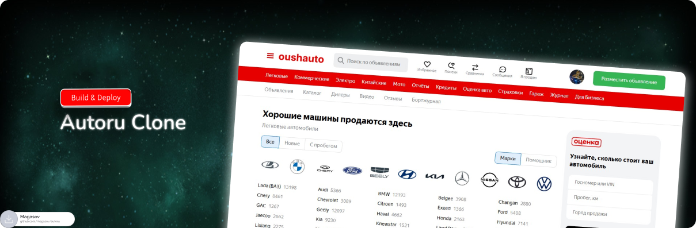

<div align="center">
  <br />
    <a href="https://github.com/magasov" target="_blank">
      
    </a>
  <br />
 
  <p>
    <code></code>
    <code></code>
    <code></code>
    <code></code>
    <code></code>
  </p>
  <h1 align="center">Auto.ru</h1>

   <div align="center">
     Знакомая платформа, но с новыми фишками. Всё как раньше — только лучше.
    </div>
</div>

## 🚀 Что реализовано

- 💬 Чат в реальном времени с отображением онлайн
- ⭐ Избранное с сохранением и быстрым доступом
- ➕🗑️ Добавление, удаление товаров
- 📰 Просмотр и сортировка по категориям
- 🔢 Подсчёт просмотров товаров и постов
- 🔒 Вход по почте с подтверждением через код
- 🔔 Email-уведомления о новых сообщениях
- 🎞 Красивые и адаптивные слайдеры изображений
- 🏷️ Мета-теги

## 📋 Tech Stack

### 🧩 Frontend (Angular)

- 🅰️ Angular 19
- 🌐 Angular Router
- 🎭 Ngx Emoji Mart + emoji-picker-element
- 📡 Axios
- 🔔 Ngx Sonner
- 🔊 Socket.IO Client
- 🧠 RxJS
- 🧪 Jasmine + Karma

### ⚙️ Backend (Node.js + Express)

- 🚂 Express.js
- 💾 MongoDB + Mongoose
- 🔐 JWT (jsonwebtoken)
- 🛡 Express Rate Limit
- 📩 Nodemailer
- 🧱 Multer (загрузка файлов)
- 🔄 Nodemon
- 🧂 bcrypt
- 🔌 Socket.IO
- 🆔 UUID
- 🌍 CORS + dotenv

## 🚀 Как начать

1. Установите [Node.js](https://nodejs.org/) (рекомендуется версия 18+).

2. Склонируйте репозиторий:
   ```bash
   git clone https://github.com/magasov/autoru.git
   cd autoru
   ```
3. В корне backend-проекта создайте файл .env и добавьте в него следующие переменные окружения (без кавычек и с вашими значениями):
   ```env
    JWT_SECRET=секретный_ключ_для_токенов_JWT
    EMAIL_USER=ваш_электронный_адрес_для_отправки_писем
    EMAIL_PASS=пароль_приложения_от_гугл_или_другой_почты (снизу ссылка для генерации)
    MONGO_URI=строка_подключения_к_вашему_кластеру_MongoDB
    PORT=8080
    CLIENT_URL=http://localhost:4200
   ```

> ⚠️ **Генерация пароля для отправки писем**  
> https://myaccount.google.com/apppasswords

4. Установите зависимости и запустите backend:

   ```bash
   cd api
   npm install
   npm run dev
   ```

5. Запустите frontend (в другом терминале):

   ```bash
   cd ../client
   npm install
   npm start
   ```

6. Откройте в браузере: http://localhost:4200

##

> ⚠️ **Дисклеймер**  
> Данный проект является **неофициальной копией Auto.ru**, созданной **исключительно в учебных целях**.  
> Он не связан с оригинальным сайтом Auto.ru, брендом, компанией "Яндекс" или её дочерними организациями.  
> Проект не используется в коммерческих целях и предназначен только для получения **практического опыта в fullstack-разработке с использованием Angular и Node.js**.
